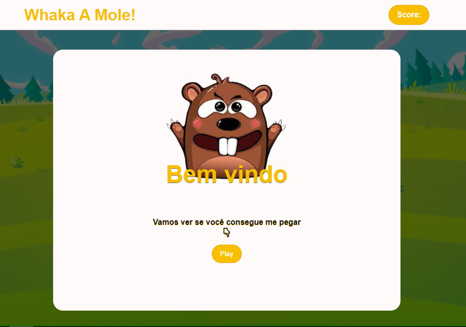
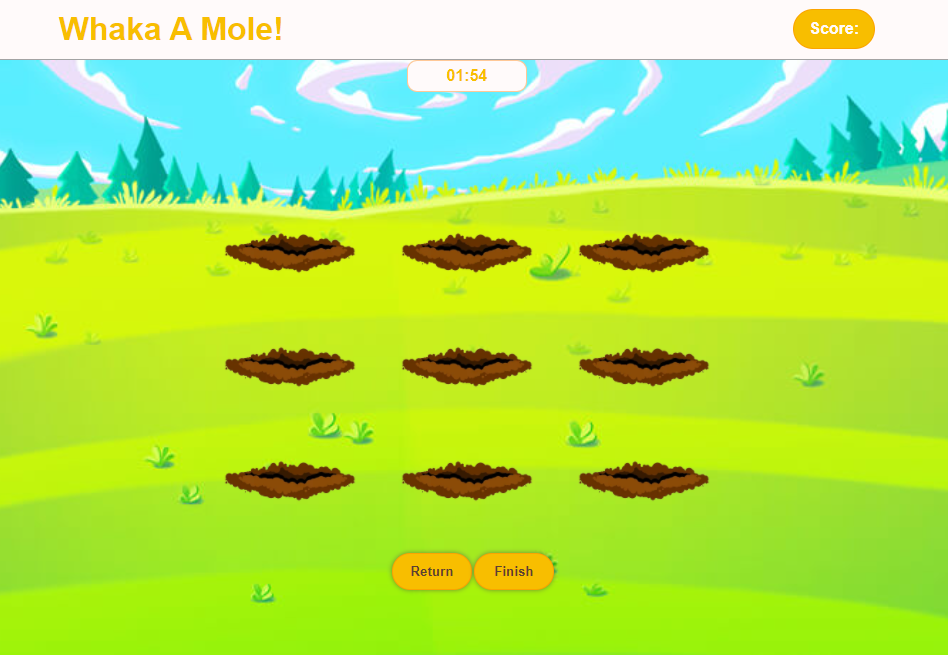
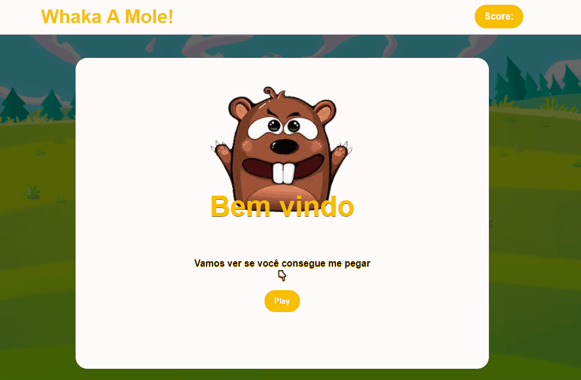

<h1 align="center">
  Whaka-a-Mole
</h1>
<p align="center">
    
    
    
    <a href="https://github.com/NyctibiusVII/Dev.Finances/blob/master/LICENSE">
        
    </a>
</p>
<p align="center">
    <a href="#projeto">Projeto</a>&nbsp;&nbsp;&nbsp;|&nbsp;&nbsp;&nbsp;
    <a href="#tecnologias">Tecnologias</a>&nbsp;&nbsp;&nbsp;|&nbsp;&nbsp;&nbsp;
    <a href="#layout">Layout</a>&nbsp;&nbsp;&nbsp;|&nbsp;&nbsp;&nbsp;
    <a href="#licença">Licença</a>
</p>

<hr>

### Projeto
<p>O Projeto desenvolvido é um jogo simples de Pegue a Toupeira. Nesse jogo o objetivo e testar a sua rapidez e habilidade na pontaria. Ao acertar a toupeira, que surgirá em buracos aleatórios, o jogador ganha pontos.</p>
<p> O intuito foi pôr em prática os conceitos de HTML5, CSS3 e JS.</p>
<p><em>Obs: o jogo está disponível apenas para desktop, em telas menores poderá apresentar inconsistência no layout</em></p>

### Funcionalidades
* Temporizador de contagem regressiva;
* Pontuador de acertos;
* É possivel pausar o jogo e o temporizador;
* Após pausar é possível retornar ao jogo sem perder a pontuação;
* Cursor personalizado; e
* Finalizar jogo; 

## Tecnologias
Esse projeto foi desenvolvido com as seguintes tecnologias:

- [Html](https://pt.wikipedia.org/wiki/HTML)
- [Css](https://pt.wikipedia.org/wiki/Cascading_Style_Sheets)
- [Javascript](https://pt.wikipedia.org/wiki/JavaScript)

## Layout
#### Desktop Screenshot
<div style="display: flex; flex-direction: 'column'; align-items: 'center';">
<!-- Responsive, 1440 x 900, 50% (Laptop L - 1440px)-->
    
    
</div>
<hr>

#### Demonstração
<div>

</div>
<p>Você pode testar o projeto a partir desse <a href="https://whaka-a-mole.netlify.app/">link</a>.

## Rodando o projeto

```bash

# Clone o repositório
$ git clone https://github.com/erickrib/Whaka-A-Mole.git

# Acesse a pasta do projeto no prompt de comando
$ cd Whaka-A-Mole

# Abra o projeto com o navegador de sua preferência
$ index.html
```
## Licença
Este projeto está sob a licença do MIT. Veja o arquivo [LICENSE](https://github.com/erickrib/Whaka-A-Mole/blob/main/LICENSE) para mais detalhes.
